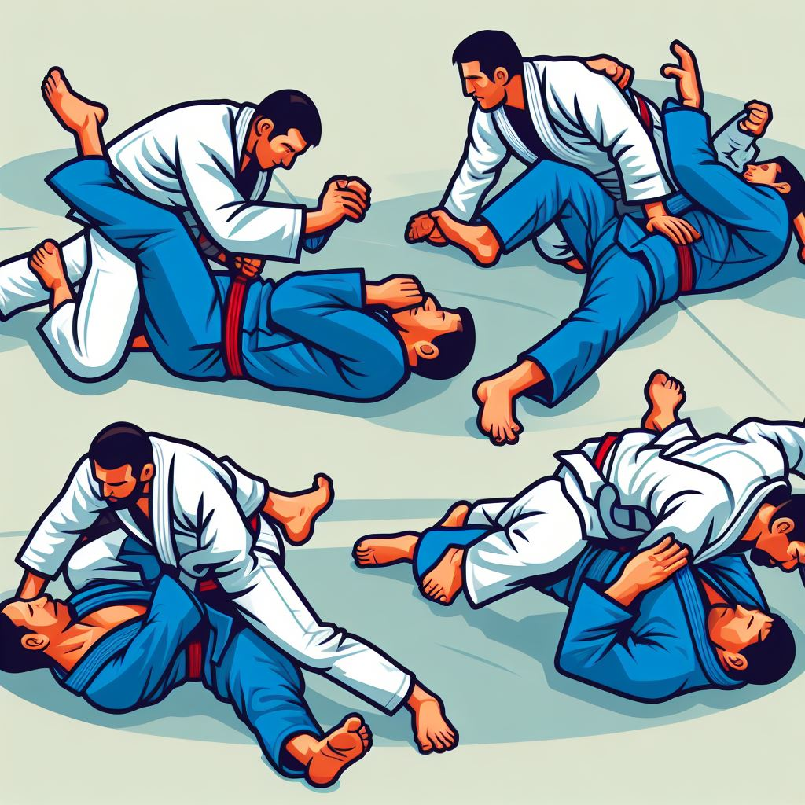

# *Brazilian Jiu-Jitsu Training Log - Lean Inception, Requisitos, SCRUM e Prototipação*

## Repositório exclusivo para entrega do MVP referente à sprint Gestão Ágil de Projetos e Produtos do curso de **Especialização em Engenharia de Software** - PUC-Rio 2024

### Artefatos:

- Arquivo “canvas-url.txt” com a url do board do Miro contendo todas as etapas realizadas para a Lean Inception, incluindo o MVP Canvas
- Arquivo “product-backlog.pdf”
- Arquivo "sprint-backlog.pdf"
- Arquivos Figma e deixe na pasta “wireframes/ e arquivos de image dos protótipos
- Arquivo de vídeo "project-showcase.mp4" e "project-showcase.txt" com a url do respectivo vídeo no Youtube

Os artefatos tratam do projeto de uma aplicação web que permite o acompanhamento objetivo do progresso do aprendizado de técnicas de Jiu-Jitsu.

### Objetivo

Artes Marciais são sistemas de luta que codificam e organizam movimentos visando ao combate corpo-a-corpo, presentes em diversas culturas e tradições milenares.
No mundo moderno, a prática de artes marciais ganhou contornos diferentes das motivações simplesmente militares que as originaram, tornando-se um negócio bilionário. Em grande medida, essa popularização se deve aos benefícios para a saúde física, mental e  possíveis benefícios para autodefesa.
Não obstante as diferenças de origens, princípios e técnicas entre esses sistemas, de alguma forma todos eles avaliam seus praticantes periodicamente, a fim de posicioná-los conforme nível técnico. Os critérios dessas avaliações podem incluir tempo de prática, frequência, resultados em torneios e desempenho nas sessões de treino, além de outros aspectos.
Em particular, a análise de desempenho e domínio técnico pode ser subjetiva, a partir da perspectiva de algum instrutor. O aluno pode sentir-se trilhando uma jornada obscura, com dificuldades para reconhecer os próprios avanços, o que pode ser bastante desmotivante.
Nesse contexto, seria muito interessante que houvesse um sistema objetivo, quantitativo, para acompanhamento do desempenho de praticantes durante sessões de treino, que pudesse ser conduzido pelo próprio praticante ou pelo professor de uma escola.
A presente ferramenta se propõe a preencher essa lacuna, possibilitando não somente o registro gradual das técnicas aprendidas por um praticante, mas também as respectivas tentativas de aplicações, como métrica de progresso na maestria das técnicas. Essas tentativas podem culminar em sucesso ou insucesso, seja no papel de ataque ou defesa do praticante em questão.
Apesar do Jiu-Jitsu Brasileiro (*Brazilian Jiu Jitsu*) ter sido aqui eleito como caso de uso, considerando sua popularidade e a tradição de prática de lutas em todas as sessões de treino, em princípio, esse sistema poderia ser aplicado a qualquer modalidade que permita contar os números de sucessos e insucessos em aplicações de técnicas. A contagem poderia ser efetuada pelo próprio praticante, com base em suas recordações do treinamento, pelo professor assistindo a um pequeno grupo de alunos ou por um sistema de Visão Computacional baseado em vídeo com Estimação de Pose.

---
